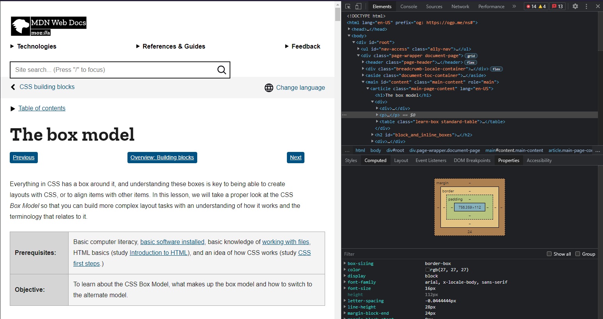
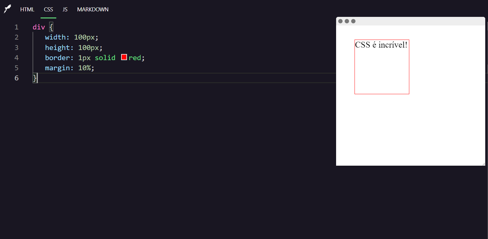
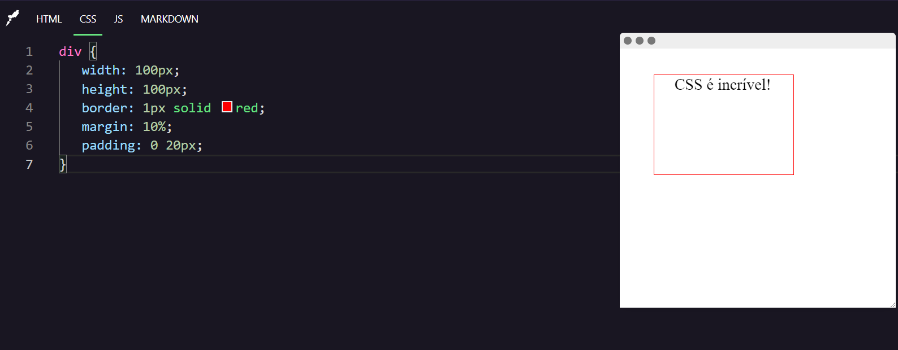
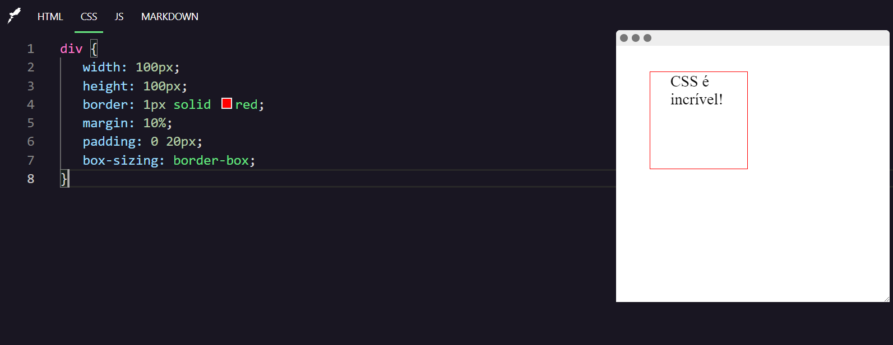
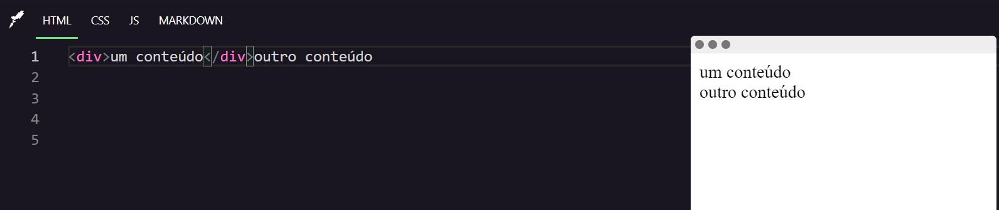
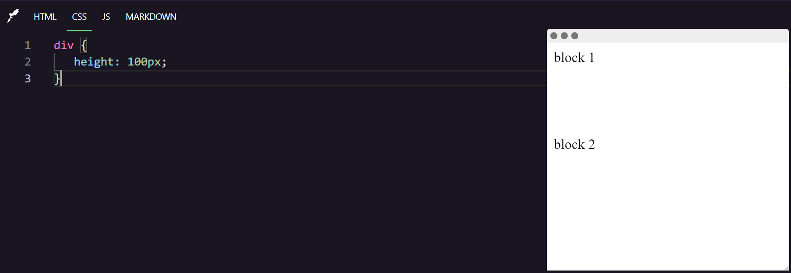
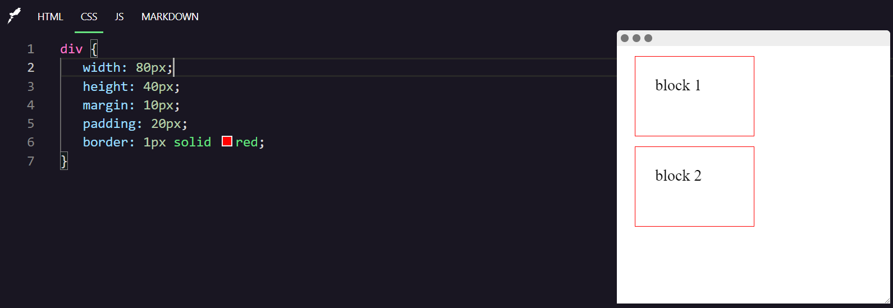
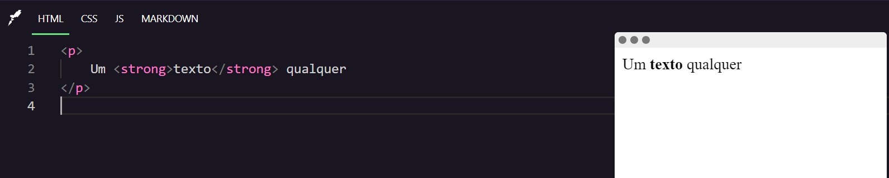
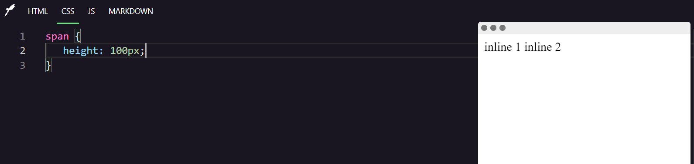
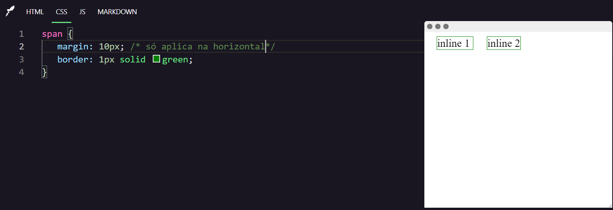

# -------------------- Box Model --------------------
O Box Model é fundamental para fazer layouts para web porque ele vai te dar maior facilidade na hora de aplicar o CSS.

Ao entender os conceitos do Box Model muitas questões do CSS começam a fazer sentido.

## O que é o Box Model?
Cada elemento é representado como uma caixa retangular<br>
Essa caixa possui propriedades de uma caixa em 2 dimensões (largura x altura)

Propriedades da caixa:

- Tamanho (largura x altura) → width | height
- Conteúdo → content
- Bordas → border
- Preenchimento interno → padding
- Espaços fora da caixa → margin


<h1 id=1> -------------------- Box Sizing</h1>

O box-sizing é responsável pelo calculo do tamanho total da caixa (box).

Podemos usar a ferramenta de desenvolvedor do próprio navegador para visualizar as especificações dos elementos da página.



💻 Exemplo:<br>
HTML:
```
<div>
	CSS é incrível!
</div>
```

CSS:
```
div {
   width: 100px; 
   height: 100px;
   border: 1px solid red;
   margin: 10%;
}
```
Esse é o resultado obtido ao usar o código acima:


Quando o padding é adicionado (`padding: 0 20px;`) faz com que aumente a largura da caixa, deixando de respeitar os `100px` de largura:


E é por isso que é tão importante conhecer a propriedade do `box-sizing`.

Por padrão o navegador vai calcular o tamanho da caixa pelo `content-box` e vai somar com os outros boxes, no exemplo acima no lugar de 100px a caixa vai ficar com uma largura de 140px. Para que isso não aconteça, é possível mudar qual vai ser a referência para o calculo do tamanho da caixa adicionando a propriedade `box-sizing: border-box;`.

Dessa forma o elemento vai ficar com a largura (`width`) determinado, que no caso do exemplo citado é de 100px.


Normalmente usa-se o código abaixo como forma de "resetar" o box-sizing que vem por padrão nos navegadores.
```
* {
   box-sizing: border-box;
}
```
O seletor * seleciona todos os elementos da página.

# -------------------- Display-block-inline
`display: block; vs display: inline;`

*Como as caixas se comportam em relação as outras caixas<br>
*Comportamento externo das caixas

## Display Block

`<p> <div> <section>, todos os headings <h1> <h2>...`

Ocupa toda a linha, colocando o próximo elemento abaixo desse

width e height são respeitados

padding, margin, border irão funcionar normalmente


## Display Inline

`<a> <strong> <span> <em>`

Os elementos ficam ao lado do outro e não empurram outros elementos para baixo

width e height não funcionam

Somente valores horizontais de margin


# -------------------- Margin
Margin, é o espaço (margem) entre os elementos

Podemos dividir o margin em 4 valores:

`margin-top | margin-right | margin-bottom | margin-left`<br>
`values: <length> | <percentage> | auto`

Geralmente usamos uma forma abreviada (shorthand) para escrever o margin. Esse formato segue o sentido horário iniciando pelo top, seguindo para right, bottom e left.
```
margin: 12px 16px 10px 4px;    | TOP = 12px | RIGHT = 16px | BOTTOM = 10px | LEFT = 4px  
margin: 12px 16px 0;           | TOP = 12px | RIGHT = 16px | BOTTOM = 0px  | LEFT = 16px 
margin: 8px 16px;              | TOP = 8px  | RIGHT = 16px | BOTTOM = 8px  | LEFT = 16px 
margin: 8px;                   | TOP = 8px  | RIGHT = 8px  | BOTTOM = 8px  | LEFT = 8px  
```
O margin tem uma aplicação mais efetiva em elementos com display block

Cuidado com o margin collapsing que é quando o top se junta ao bottom

Quando a margem right e o left de duas caixas se encontram eles são somados, mas quando o bottom e o top delas se encontram o com maior valor predomina

# -------------------- Padding

O padding é o preenchimento interno da caixa.

A propriedade padding pode ser escrita como nos formatos apresentados abaixo:

`padding-top | padding-right | padding-bottom | padding-left`

Geralmente usamos uma forma abreviada (shorthand) para escrever o padding. Esse formato segue o sentido horário iniciando pelo top, seguindo para right, bottom e left.
```
padding: 12px 16px 10px 4px;    | TOP = 12px | RIGHT = 16px | BOTTOM = 10px | LEFT = 4px 
padding: 12px 16px 0;           | TOP = 12px | RIGHT = 16px | BOTTOM = 0px  | LEFT = 16px 
padding: 8px 16px;              | TOP = 8px  | RIGHT = 16px | BOTTOM = 8px  | LEFT = 16px 
padding: 8px;                   | TOP = 8px  | RIGHT = 8px  | BOTTOM = 8px  | LEFT = 8px 
```
O padding pode ter valores (values) de comprimento (px, em, rem) ou de porcentagem (%)

O padding poderá causar diferença na largura de um elemento<br>
obs.: Em <a href= #1>box-sizing</a> mostra como resolver essa diferença na largura do elemento
# -------------------- Border-outline

São as bordas da caixa

Documentação do MDN: https://developer.mozilla.org/en-US/docs/Web/CSS/border

`value: <border-style> | <border-width> | <border-color>`

`style: solid | dotted | dashed | double | groove | ridge | inset | outset`<br>
`width: <length>`<br>
`color: <color>`<br>

```
	/* shorthand */
	border-top: solid 2px;    | top | right | bottom | left

	/* style */
	border: solid;

	/* width <length> | style */
	border: 2px dotted;

	/* style | color */
	border: outset #f33;

	/* width | style | color */
	border: medium dashed green;
```

## E o outline?

O outline é muito semelhante ao border, mas difere em 4 sentidos:

- Não modifica o tamanho da caixa, pois não é parte do Box Model;
- Poderá ser diferente de retângular;
- Não permite ajuste individuais;
- Mais usado pelo user agent para acessibilidade.