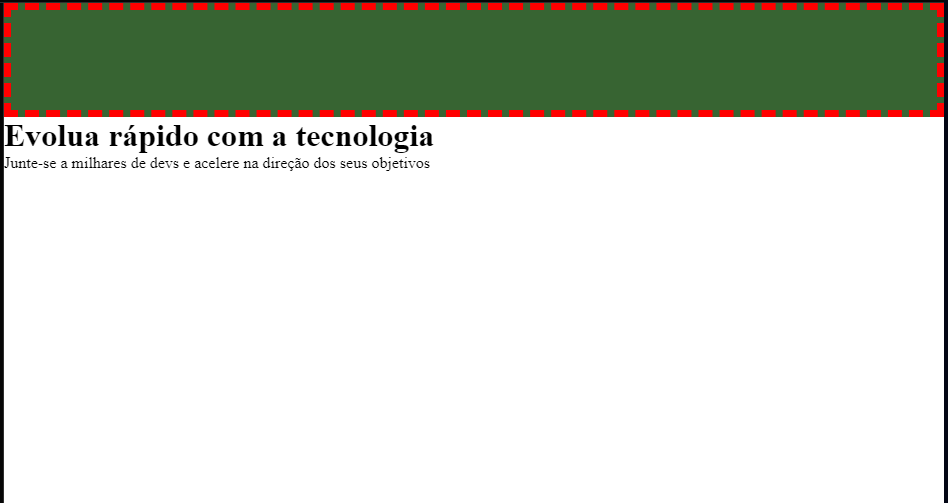

# -------------------- Cores --------------------
Usamos CSS para alterar as cores do nosso documento.

## Tipos

background-color (para caixas)<br>
color (para textos)<br>
border-color (para caixas)<br>
outros

## Valores

Podemos definir os valores por:

palavra-chave (blue, transparent)<br>
hexadecimal (#990011)<br>
funções: rgb, rgba, hsl, hsla

# Hexadecimal --------------------
Abaixo mostra como trabalhar com valores hexadecimal

```
<hex-color> values 0-9 e A-F

color: #090;       RED, GREEN, BLUE 
color: #009900;    RED, GREEN, BLUE
color: #090a;      RED, GREEN, BLUE, TRANSPARENCY
color:#009900aa;   RED, GREEN, BLUE, TRANSPARENCY
```
# RGB --------------------
RGB → Red, Green e Blue<br>
O alpha representa a transparência da cor
```
<rgb()> values 0-255
color: rgb(34, 12, 64, 0.6)
color: rgba(34, 12, 64, 0.6)
```
# HSL --------------------
HSL → Hue - Saturation - Lightness

```
color: hsl(180, 100%, 50%, 60%)     COR, SATURAÇÃO, LUZ, TRANSPARÊNCIA
color: hsla(180, 100%, 50%, 60%)
```
# Global values --------------------
Veremos agora sobre os valores globais da propriedade `color`.

```
color: inheritr;        Herda a cor do elemento anterior 
color: initial;         Volta a sua cor inicial 
color: unset;           Pega a cor do contexto 
color: currentcolor     Pega a cor do contexto
```

<strong>Referência:</strong>
https://developer.mozilla.org/en-US/docs/Web/CSS/color_value

# -------------------- Background --------------------

- Define um fundo para nosso elemento
- Sua área de atuação é a caixa toda
- Por padrão, é transparente

### Exemplos

- Usar cores solidas
- Usar imagens
- Controlar
    - a posição das imagens
    - se elas se repetem ou não
    - o tamanho delas na caixa
- Usar cor e imagem juntas
- Usar cor gradiente

## Background-color
A propriedade `background-color` define a cor de fundo do elemento selecionado.

HTML
```
<header>

</header>
<main>
    <h1>Evolua rápido com a tecnologia</h1>
    <p>Junte-se a milhares de devs e acelere
    na direção dos seus objetivos</p>
</main>
```
CSS
```
* {
    margin: 0;
}

header {
    height: 100px;
    border: 7px dashed red;
    background-color: rgb(55, 100, 50);
}
```


## Background-image-repeat
Para adicionar uma imagem como background podemos usar a propriedade `background-image`<br>
Por padrão a imagem vai se repetir e podemos modificar essa opção usando a propriedade `background-repeat`
```
Values

background-repeat: repeat-x;
background-repeat: repeat-y;
background-repeat: repeat;
background-repeat: space;
background-repeat: round;
background-repeat: no-repeat;

Podedmos usar 2 valores: horizontal | vertical

background-repeat: repeat space;
background-repeat: repeat repeat;
background-repeat: round space;
background-repeat: no-repeat round;
```

## Background-position
Com a propriedade `background-position` podemos mudar a posição da imagem do background.
```
Pricipais valores

background-position: top;
background-position: bottom;
background-position: left;
background-position: right;
background-position: center;
```

## Background-size
Para mudar o tamanho da imagem do background usamos a propriedade `background-size`.

```
Values

background-size: cover;
background-size: contain;

Podemos usar 2 valores, o primeiro é para a largura da imagem e o segundo é para a altura

background-size: 40% auto;
background-size: 2em 25%;
background-size: auto 8px;
background-size: auto auto;
```

## Background-origin-clip
A propriedade `background-origin` é quem define o ponto de origem de uma imagem específica.
```
Principais valores

background-origin: border-box;
background-origin: padding-box;
background-origin: content-box;
```
O `background-clip` define se a cor ou imagem do background iniciam debaixo de sua área de borda, preenchimento ou conteúdo.
```
Principais valores

background-clip: border-box;
background-clip: padding-box;
background-clip: content-box;
background-clip: text;
```

## Background-attachment
A propriedade `background-attachment` determina se a posição da imagem vai ser fixa ou se vai rolar junto com o conteúdo.

```
Principais valores

background-attachment: scroll;
background-attachment: fixed;
background-attachment: local;
```

## Shorthand
Podemos usar o shorthand `background` para definir todos os valores do background

```
    - background properties -

    background-color: rgb(55, 100, 50);
    background-image: url(images/bg.gif);
    background-repeat: no-repeat;
    background-position: right top;
    background-size: 50px;
    background-origin: border-box;
    background-clip: content-box;
    background-attachment: fixed;


    - background shorthand -

    background: rgb(55, 100, 50) url(images/bg.gif) no-repeat right top / 50px border-box content-box fixed;
```
## Gradient

`linear-gradient()` é a função usada para criar gradient linear com o CSS.

```
background: linear-gradient(45deg, red, yellow)
```

`radial-gradient()` é a função usada para criar gradient circular.

```
background: radial-gradient(green, red, yellow)
background: radial-gradient(rgba(255, 255, 255, 0), rgba(255, 0, 0, 0.2))
```

## Múltiplos valores
Podemos aplicar múltiplos backgrounds em um mesmo elemento, podendo ter cor sólida, gradiente ou imagem. Para isso basta separar por vírgula cada background.

```
background: linear-gradient(rgba(255, 255, 255, 0), rgba(255, 0, 0, 0.2)), 
url(images/bg.gif) no-repeat right top / 50px border-box content-box fixed;
```